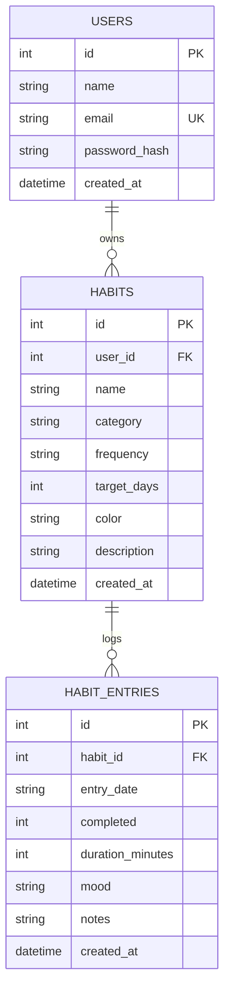

# WellTrack Database ERD

WellTrack uses SQLite with three related tables.

## Entity Relationship Diagram

## Table Definitions

### `users`

Stores account credentials and profile basics.

| Column | Type | Notes |
|--------|------|-------|
| `id` | INTEGER PK | Auto-increment |
| `name` | TEXT | Display name |
| `email` | TEXT UNIQUE | Login identifier |
| `password_hash` | TEXT | bcrypt hash |
| `created_at` | TEXT | ISO timestamp |

### `habits`

Represents a wellness routine owned by a user.

| Column | Type | Notes |
|--------|------|-------|
| `id` | INTEGER PK | Auto-increment |
| `user_id` | INTEGER FK | References `users.id` |
| `name` | TEXT | Habit title |
| `category` | TEXT | fitness, nutrition, mindfulness, sleep, productivity, social |
| `frequency` | TEXT | daily, weekly, custom |
| `target_days` | INTEGER | Weekly target (1–31) |
| `color` | TEXT | Hex color for UI |
| `description` | TEXT | Optional notes |
| `created_at` | TEXT | ISO timestamp |

### `habit_entries`

Stores one log per habit per day.

| Column | Type | Notes |
|--------|------|-------|
| `id` | INTEGER PK | Auto-increment |
| `habit_id` | INTEGER FK | References `habits.id` |
| `entry_date` | TEXT | ISO date (`YYYY-MM-DD`) |
| `completed` | INTEGER | 0 or 1 |
| `duration_minutes` | INTEGER | Optional duration |
| `mood` | TEXT | great, good, okay, low, stressed |
| `notes` | TEXT | Optional reflection |
| `created_at` | TEXT | ISO timestamp |

## Relationships

- One user can own many habits (`users.id` → `habits.user_id`)
- One habit can have many entries (`habits.id` → `habit_entries.habit_id`)
- `habit_entries` enforces one entry per habit per date via `UNIQUE(habit_id, entry_date)`
- Deleting a user cascades to habits and entries

## CRUD Coverage

| Table | Create | Read | Update | Delete |
|-------|--------|------|--------|--------|
| users | register | profile/login | — | — |
| habits | POST `/api/habits` | GET `/api/habits` | PUT `/api/habits/:id` | DELETE `/api/habits/:id` |
| habit_entries | POST `/api/entries` | GET `/api/entries` | PATCH `/api/entries/:id` | DELETE `/api/entries/:id` |
